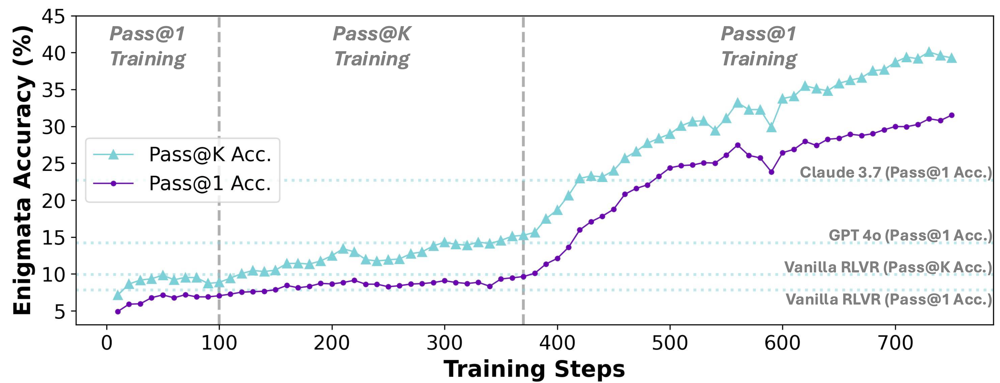
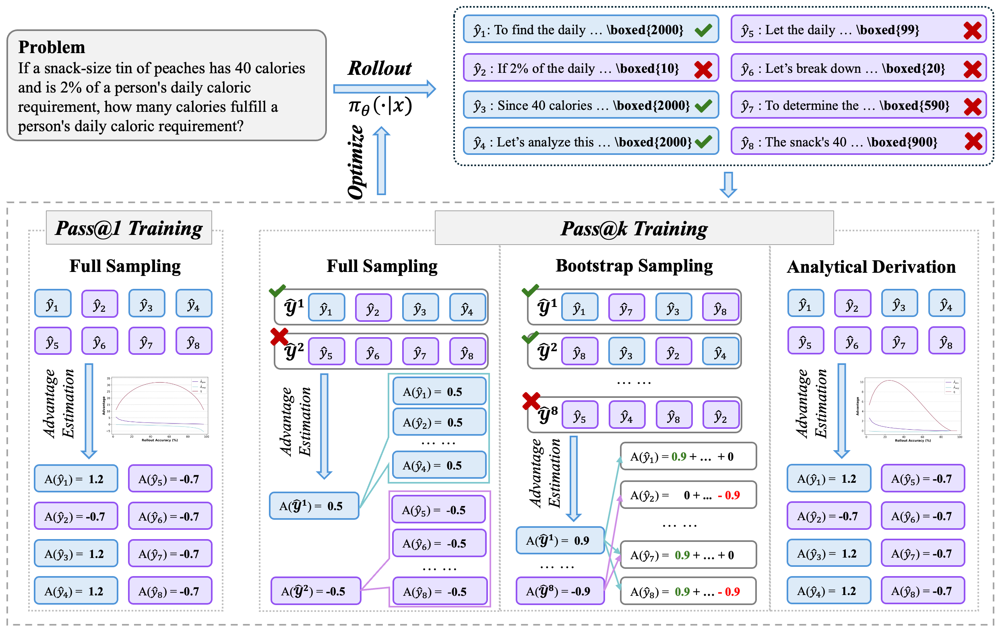
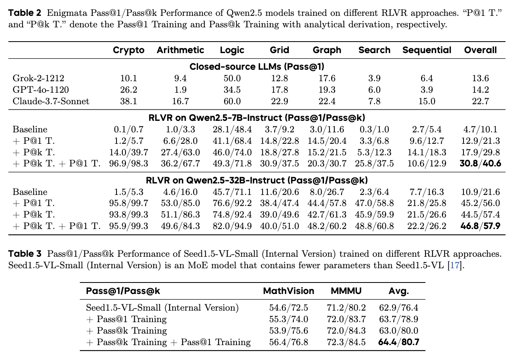

<div align='center'>
<h1>Pass@k Training for Adptively Balancing<br>Eplortion and Exploitation of LRMs</h1>


<sup>1</sup>Renmin University of China, <sup>2</sup>ByteDance Seed

<!-- TODO:  Thread,Paper,Dataset,Weights-->
[](xxx)
[](https://github.com/RUCAIBox/Passk_Training/tree/main/code)
[](https://huggingface.co/datasets/RUC-AIBOX/Passk_Training_Maze)
</div>

# Introduction

Reinforcement Learning with Verifiable Rewards (RLVR), which typically adopts Pass@1 as the reward, has faced the issues in balancing exploration and exploitation, causing policies to prefer conservative actions, converging to a local optimum. Identifying an appropriate reward metric is therefore crucial.

Regarding the prior work, although Pass@k has been used in evaluation, its connection to LLM exploration ability remains largely overlooked. To investigate this, we first utilize Pass@k as the reward to train the policy model (i.e., **Pass@k training**), and observe the improvement on its exploration ability. Next, we derive an analytical solution for the advantage of Pass@k training, leading to an efficient and effective process. Building on this, our analysis reveals that exploration and exploitation are not inherently conflicting objectives, while they can mutually enhance each other. Moreover, Pass@k training with analytical derivation essentially involves directly designing the advantage function. Inspired by this, we initially explore the advantage design for RLVR, showing promising results and highlighting a potential future direction.




# Pass@k Training

Given the question $x$, the policy model is utilized to rollout the $k$ responses through a specific decoding strategy or searching algorithm (e.g., sampling-based decoding strategy or Monte Carlo Tree Search). The $i$-th sampled response $\hat{y}\_i$ will receive a reward $R\_i$, which is provided by the verifier. Based on this, the value of the Pass@k metric is defined as the expected maximum reward obtained from the $k$ sampled responses. Formally, the Pass@k metric can be computed using the following equation,

$$
\text{Pass@k} = \mathbb{E}\_{(x,y)\sim D,\\{\hat{y}\_i\\}_{i=1}^K\sim \pi\_\theta(\cdot|x)}\left[\max\left(R_1, \dots, R_K)\right)\right].
$$

The Pass@k metric is utilized as the reward function in the RLVR training process. To improve the effectiveness and efficiency of the Pass@k Training process, we compute the analytical solution of the advantage value of positive responses as follows,

$$
\bar{R}^{\text{group}}=1-\frac{\binom{N\_\text{neg}}{k}}{\binom{N\_\text{rollout}}{k}}, \sigma^\text{group}=\sqrt{\bar{R}^\text{group}\times\left(1-\bar{R}^\text{group}\right)},
$$

$$
\hat{A}\_{\text{pos}}=\frac{1-\bar{R}^{\text{group}}}{\sigma^{\text{group}}}, \hat{A}\_{\text{neg}}=\left(1-\bar{R}^\text{group}-\frac{\binom{N\_\text{neg}-1}{k-1}}{\binom{N\_\text{rollout}-1}{k-1}}\right)\times\left(\sigma^\text{group}\right)^{-1}.
$$

The implementation details of **Pass@k Training with Analytical Derivation** can be found in [`code/passk_adv.py`](code/passk_adv.py), which is utilized to compute the advantage values of each response and adapted to the verl framework.
Besides, the code of the verifier of Maze tasks can be found in [`code/maze_verifier.py`](code/maze_verifier.py).




# Key Insights

+ Compared to Pass@1 training, **Pass@k training significantly enhances the exploration ability of LLMs, improving Pass@k performance while maintaining Pass@1**. Among its three progressive variants, bootstrap sampling offers higher training efficiency than full sampling, and analytical derivation serves as its theoretical asymptotic form that mitigates the variance introduced by sampling.

+ Compared to baseline methods, Pass@k training is both robust to different values of K and generalizable across domains and tasks. **The enhancement of LLM exploration ability is helpful to improve their exploitation through continual training**, leading 7B LLM to surpass the powerful LLMs (e.g., GPT-4o and Claude-3.7), highlighting the practical value of Pass@k training.

+ Pass@k training with analytical derivation, which directly designs the advantage function, can be viewed as a form of implicit reward design. Following this idea, empirical experiments suggest that **implicit reward design allows finer-grained control over optimization**, such as focusing on harder problems or improving training efficiency, without complex theoretical derivations, making it a promising direction for future RLVR development.

# Key Performance

The benefits brought by Pass@k training can be transferred to Pass@1 performance of LLMs, which is not affected by the scale of model parameters (e.g., 7B or 32B), model architecture (e.g, dense model or MoE model), model family (i.e., Qwen model or Seed model), or downstream tasks (natural language tasks or multi-modal tasks).




# Acknowledgement
We sincerely thank the [verl](https://github.com/volcengine/verl) for providing the awesome open-source RL infrastructure.

We sincerely thank Enigmata Team to provide the training and test sets of Enigmata and share experiences of RLVR training on logic puzzles. We appreciate Songhua Cai and other contributors of the Seed Infrastructure team for infrastructure support.

# Reference

Please kindly cite our report if it is helpful for your research.

```
@article{Passk_Training,
  title={Pass@k Training for Adaptively Balancing Exploration and Exploitation of Large Reasoning Models},
  author={Chen, Zhipeng and Qin, Xiaobo and Wu, Youbin and Ling, Yue and Ye, Qinghao and Zhao, Wayne Xin and Shi, Guang},
  journal={arXiv preprint arXiv:xxx},
  year={2025}
}
```
